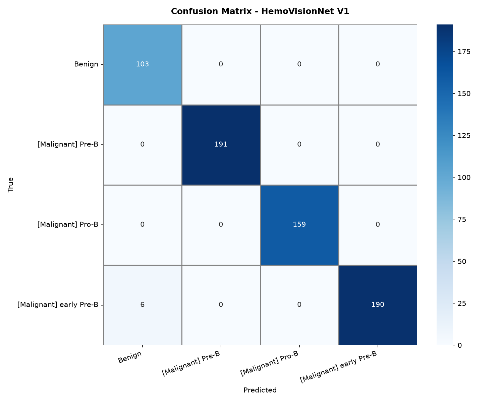
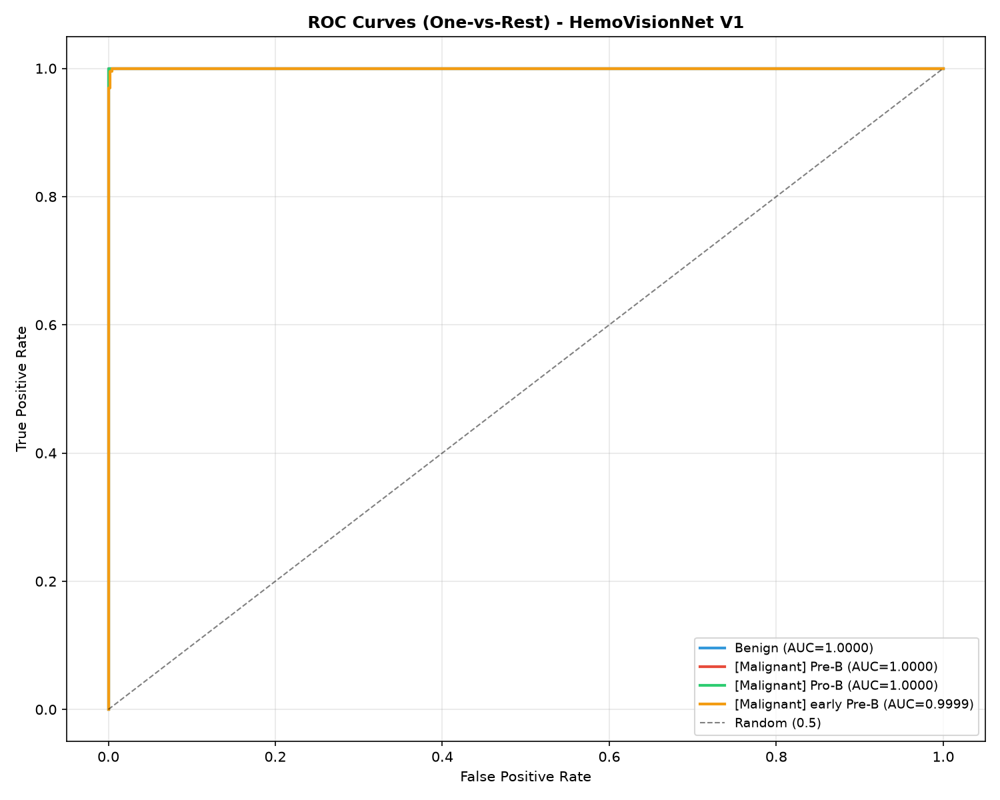
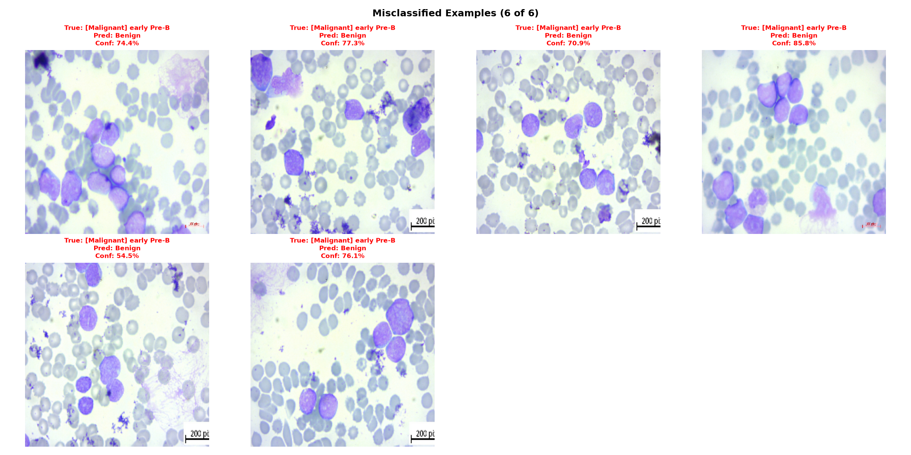
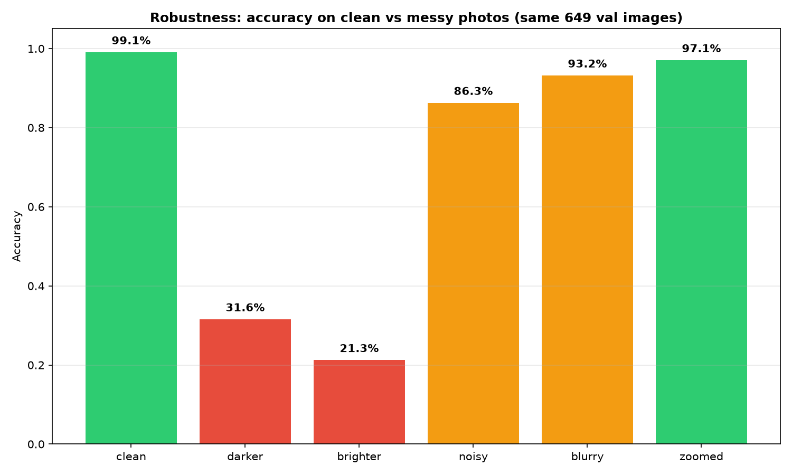
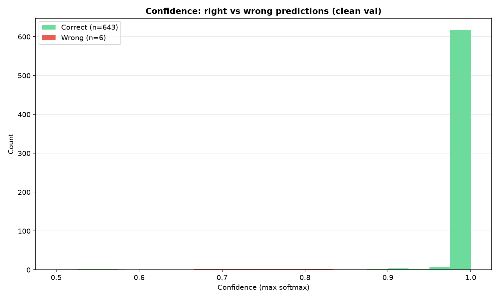

# HemoVisionAI — Model Evaluation Report

**Model:** HemoVisionNet V1 (`saved_models/hemovisionnet_v1_best.keras`)
**Date:** 2026-10-01
**Dataset:** Blood cell Cancer [ALL] — 4 classes, 3242 images total
**Split:** 2593 train / 649 validation (stratified, seed=42, 80/20)
**Image size:** 224×224 | **Batch:** 16 | **Params:** 1,233,540
**Evaluated on:** validation set only (never seen during training)

> How to re-use this report: re-run the evaluation (see Section 9), fresh numbers + charts overwrite `reports/figures/`. This file is a template — just update the date + metrics.

---

## 1. Simple summary (for anyone)

The model looked at **649 new blood-cell photos** it had never studied before.

* **Got right: 643 out of 649 = 99.08%**
* **Got wrong: only 6 photos (0.92%)**
* It uses all 4 answers correctly — it is not stuck on one guess.
* Confidence is very high (mostly 94–100% on correct answers).

In plain words: the student graduated with top marks. No retraining needed right now.

---

## 2. How we tested (fair test)

* Same data split as training via `preprocessing/data_pipeline.py:get_datasets()` with `seed=42` — guarantees the 649 val photos are identical every run, no leakage.
* Preprocessing: read file → decode RGB → resize 224×224 → keep pixels in `[0, 255]`. The model has an internal `Rescaling(1/255)` layer, so we do **not** divide by 255 outside — double-normalisation would break predictions.
* Environment: Python 3.12, TensorFlow 2.21.0 CPU-only, scikit-learn, matplotlib/seaborn.
* Checkpoint verified to exist before loading; output shape checked to be 4 classes.

Train / val distribution (stratified, proportions preserved):

| Split | Benign | [Malignant] Pre-B | [Malignant] Pro-B | [Malignant] early Pre-B | Total |
|---|---|---|---|---|---|
| Train | 409 (15.8%) | 764 (29.5%) | 637 (24.6%) | 783 (30.2%) | 2593 |
| Val | 103 (15.9%) | 191 (29.4%) | 159 (24.5%) | 196 (30.2%) | 649 |

---

## 3. Overall scores

| Metric | Value | What it means in simple words |
|---|---|---|
| Accuracy | **0.9908 (99.08%)** | Share of all guesses that were right |
| Loss | 0.0224 | Lower = more confident + correct; near 0 is excellent |
| Macro Precision | 0.9862 | When it says a type, how often is it right (averaged over 4 types) |
| Macro Recall | 0.9923 | Out of all real cases of each type, how many it catches |
| Macro F1 | 0.9890 | Balance of the two above; 1.0 is perfect |
| Macro AUC | 1.0000 | Ability to separate each type from the rest; 1.0 is perfect, 0.5 is random |

```
                         precision    recall  f1-score   support

                 Benign     0.9450    1.0000    0.9717       103
      [Malignant] Pre-B     1.0000    1.0000    1.0000       191
      [Malignant] Pro-B     1.0000    1.0000    1.0000       159
[Malignant] early Pre-B     1.0000    0.9694    0.9845       196

               accuracy                         0.9908       649
              macro avg     0.9862    0.9923    0.9890       649
           weighted avg     0.9913    0.9908    0.9908       649
```

---

## 4. Per-type scores

| True type | Photos | Predicted as this type | Precision | Recall | F1 | AUC |
|---|---|---|---|---|---|---|
| Benign | 103 | 109 | 0.9450 | **1.0000** | 0.9717 | 1.0000 |
| [Malignant] Pre-B | 191 | 191 | 1.0000 | 1.0000 | 1.0000 | 1.0000 |
| [Malignant] Pro-B | 159 | 159 | 1.0000 | 1.0000 | 1.0000 | 1.0000 |
| [Malignant] early Pre-B | 196 | 190 | 1.0000 | 0.9694 | 0.9845 | 0.9999 |

Reading help:
* **Benign recall 1.0** = it catches every healthy case, never misses one. Precision 0.945 = 6 early Pre-B photos were wrongly called Benign.
* **Pre-B and Pro-B are perfect** — 100% on all metrics.
* **early Pre-B recall 0.969** = 6 out of 196 early Pre-B were missed (called Benign). When it says early Pre-B, it is always right (precision 1.0).

---

## 5. Confusion matrix — where does it confuse?

Rows = true type, columns = what the model guessed.

|  | Pred Benign | Pred Pre-B | Pred Pro-B | Pred early Pre-B |
|---|---|---|---|---|
| **True Benign** | **103** | 0 | 0 | 0 |
| **True Pre-B** | 0 | **191** | 0 | 0 |
| **True Pro-B** | 0 | 0 | **159** | 0 |
| **True early Pre-B** | **6** | 0 | 0 | **190** |



Only mistake pattern: **6× early Pre-B → Benign**. No confusion between the three malignant sub-types. This is the safest kind of error to have left (malignant called benign still needs review — see Limitations), but there is a clear single pattern to improve if you retrain later.

---

## 6. ROC curves — separability per type

Each curve = one type vs all others. Closer to the top-left corner = better.



| Type | AUC |
|---|---|
| Benign | 1.0000 |
| [Malignant] Pre-B | 1.0000 |
| [Malignant] Pro-B | 1.0000 |
| [Malignant] early Pre-B | 0.9999 |
| **Macro average** | **1.0000** |

Simple meaning: the model separates each disease type almost perfectly from the rest. Random guessing would be 0.5.

---

## 7. Mistake examples

**Total: 6 / 649 misclassified (0.92%).** All 6 shown below with true label, wrong prediction, and confidence.



What to look at: all 6 are early Pre-B called Benign. Check if these 6 look paler / have fewer visible blasts than typical early Pre-B — if so, future work could add more such borderline examples or use Grad-CAM to see where the model looks.

Quick sanity check from training data (expected to be 100%): 20/20 correct (5 per class, confidence 0.94–1.00, spread 5/5/5/5). This only proves the model is not broken, not that it generalises — the 99.08% above is the real score.

---

## 8. Model details (technical)

* Architecture HemoVisionNet V1: Input(224,224,3) → augmentation (Flip/Rotation 0.1/Zoom 0.1/Contrast 0.1, training-only) → Rescaling(1/255) → Conv32+BN+ReLU+MaxPool → [Conv64×2+BN+ReLU]+Pool → [Conv128×2]+Pool → [Conv256×2]+Pool (14×14×256) → GAP → Dense256 ReLU → Dropout 0.5 → Softmax(4). Optimiser Adam lr=0.001, loss sparse_categorical_crossentropy.
* Training callbacks (from notebook 03): EarlyStopping(val_loss, patience 8, restore best), ModelCheckpoint(val_accuracy, best only), ReduceLROnPlateau(factor 0.2, patience 4, min 1e-6), 50 epochs max.
* Files: model `saved_models/hemovisionnet_v1_best.keras` (15 MB), duplicate `notebooks/best_hemovisionnet_v1.keras`, config `config.py`, pipeline `preprocessing/data_pipeline.py` (385 lines).

---

## 9. How to reproduce this report

```bash
# from HemoVisionAI/
.venv/bin/python -c "
from preprocessing.data_pipeline import get_datasets
import tensorflow as tf
_, val_ds, class_names = get_datasets(dataset_dir='dataset/Blood cell Cancer [ALL]')
model = tf.keras.models.load_model('saved_models/hemovisionnet_v1_best.keras')
print(model.evaluate(val_ds))
"
```

* Change nothing in `config.py` (SEED=42) or you will get a different split.
* Figures regeneration script saved metrics to `reports/figures/metrics.json` — reuse it for the next run.
* Full notebook logic lives in `notebooks/04.model_evaluation.ipynb` (cells 1–11).

---

## 10. Limitations

* Validation-only, single dataset source (Kaggle `mohammadamireshraghi/blood-cell-cancer-all-4class`). Not tested on external hospital / microscope data — real-world accuracy will be lower.
* Class imbalance mild (Benign only 15.8%) — benign precision already shows the effect.
* CPU-only evaluation; training history / curves not stored in this repo.
* No explainability yet (`explainability/gradcam.py` is still a stub) — cannot show *why* the 6 mistakes happened.
* `models/`, `training/`, `evaluation/` modules are still stubs — real logic is in notebooks + `data_pipeline.py`.
* Brightness fragile (see Section 12) — dark/bright photos break it; needs brightness augmentation if retrained.

---

## 12. Robustness — messy photos, luck check, confidence (no external data)

You said you have no outside photos, so I faked the messy real world from the same 649 val photos. Method in `metrics_robustness.json`. Important: this is simulated messiness, not hospital proof.

### 12a. Messy-photo stress test (same 649 images, 5 corruptions)

| Version | What I did | Accuracy | Simple meaning |
|---|---|---|---|
| clean | nothing, original | **99.08%** | baseline |
| darker (×0.6) | made every photo 40% darker | **31.59%** | breaks badly — lighting matters a lot |
| brighter (×1.4, clipped) | made every photo 40% brighter | **21.26%** | breaks badly |
| noisy (gaussian σ=10) | added grain like a cheap camera | **86.29%** | drops but still usable |
| blurry (down to 56px then up) | simulated out-of-focus | **93.22%** | small drop, quite sturdy |
| zoomed (center 80% crop) | simulated closer zoom | **97.07%** | almost no drop, very sturdy |



Why the brightness drop? Training only used tiny contrast change (0.1) plus flip/rotation/zoom — it never saw big dark/bright shifts. So it learned "brightness = part of the answer", which is wrong. Fix for next training: add `RandomBrightness` / stronger contrast augmentation and re-train (best done on free GPU).

Practical rule for now: only trust predictions on normally-lit, clear photos like the training set. If a photo looks clearly dark or washed-out to your eyes, don't trust the answer.

### 12b. Luck check — different splits

Same model, different shuffles (note: model was trained on seed 42, so seeds 43/44 partly overlap its training data — slightly optimistic, but still a stability signal):

| Split | Accuracy |
|---|---|
| seed 42 (original) | 99.08% |
| seed 43 | 99.23% |
| seed 44 | 99.38% |

All three are 99%+ — the 99% is not a lucky split.

### 12c. Confidence honesty

* Average confidence when right: **0.992** (very sure, correctly)
* Average confidence when wrong (6 photos): **0.732** (hesitant)



Good news: when it makes mistakes, it is much less sure. Rule of thumb: if the app ever shows confidence below ~0.80, flag for human review.

Raw numbers: `reports/figures/metrics_robustness.json`. Charts: `reports/figures/robustness.png`, `reports/figures/confidence.png`.

---

## 11. Next steps

1. Fill `explainability/gradcam.py` and add heatmaps for the 6 mistakes.
2. Build `backend/` FastAPI `/predict` + `frontend/` upload page (both folders empty today). Add a brightness warning + low-confidence flag from Section 12.
3. Collect / test on external data before any clinical claim.
4. If retraining: add brightness augmentation first (fixes Section 12a), focus on early Pre-B vs Benign borderline cases; consider transfer learning (`models/resnet50.py`, `efficientnet.py` stubs).

---
*Generated from live evaluation of `hemovisionnet_v1_best.keras` on 649 val images. Raw numbers: `reports/figures/metrics.json`.*
